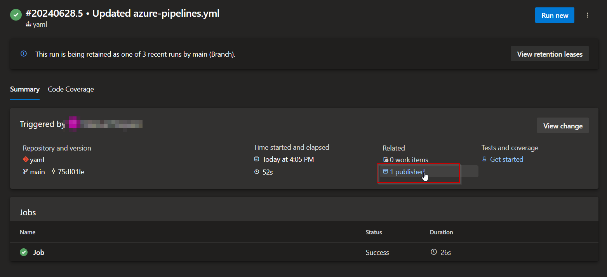
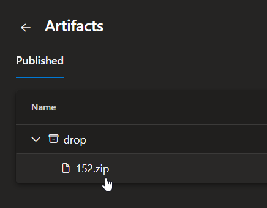
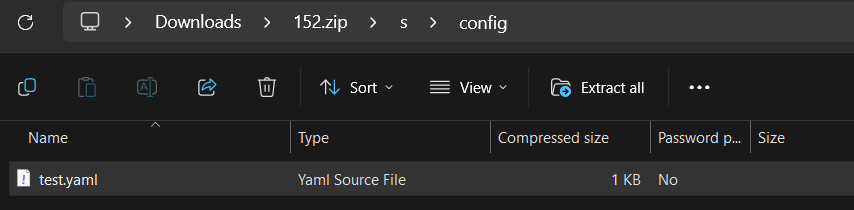
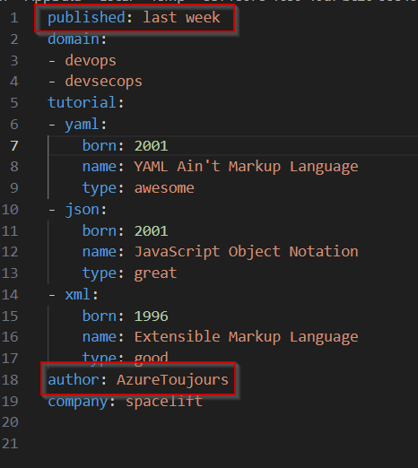

# ReplaceYaml

1. In [replaceYaml.ps1](./powershell/replaceYaml.ps1), create the necessary parameters inside the param block starting in line 4.
2. Then edit the file to update the yaml fields (line 13).
3. In [azure-pipelines.yaml](./azure-pipelines.yaml), set the file path of the yaml file you want to update (line 21).
4. Set the file path of replaceYaml.ps1 in line 22.
5. Update the parameters of the ps1 call in line 22.

Run the pipeline and download the publish artifact.

Open the download archive and open test.yaml

The file now conains the updated values.

